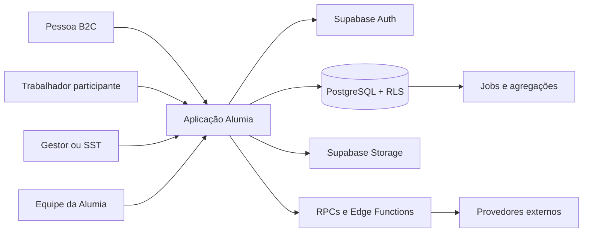

# Especificação de arquitetura

**ID:** `ARCH`  
**Versão:** 0.1.0  
**Estado:** proposed

## 1. Estilo arquitetural

A Alumia usa uma aplicação web responsiva, mobile-first e instalável, com arquitetura pragmática em camadas:

```text
Rotas e páginas
    ↓
Componentes de feature e componentes UI
    ↓
Hooks de consulta, mutação e orquestração
    ↓
Cliente Supabase, RPCs e Edge Functions
    ↓
PostgreSQL + RLS + Storage + jobs
```

Dependências permitidas:

```text
pages → features → hooks → integrations
            ↘       ↘
              domain

ui não importa hooks de domínio
domain não importa React, DOM ou Supabase
integrations não importa componentes
```

## 2. Stack obrigatória

| Camada | Escolha |
|---|---|
| Linguagem | TypeScript estrito |
| UI | React + Vite + SWC |
| Rotas | React Router |
| Estado remoto | TanStack React Query |
| Backend | Supabase Postgres, Auth, Storage, RPCs e Edge Functions |
| Estilo | Tailwind CSS |
| Componentes | shadcn/ui + Radix UI |
| Ícones | Hugeicons Stroke Rounded |
| Formulários | React Hook Form + Zod |
| Datas | date-fns |
| Testes | Vitest, Testing Library e Playwright para smoke E2E |
| PWA | vite-plugin-pwa depois da vertical web estável |
| Mobile | Capacitor apenas após validação do MVP web |

Versões exatas ficam travadas no lockfile criado no bootstrap. Dependências opcionais entram somente quando uma especificação aprovada exigir.

## 3. Contexto do sistema



Fronteiras de confiança:

- navegador é não confiável;
- JWT autentica, mas não substitui autorização;
- RLS protege leitura e escrita normal;
- RPCs executam transações de banco;
- Edge Functions guardam segredos e integrações;
- service role existe somente em ambiente server-side;
- respostas ocupacionais brutas não são consultadas diretamente por gestores.

## 4. Estrutura do repositório

```text
alumia/
├── public/
├── src/
│   ├── app/
│   │   ├── App.tsx
│   │   ├── routes.tsx
│   │   └── providers.tsx
│   ├── components/ui/
│   ├── features/
│   │   ├── auth/
│   │   ├── onboarding/
│   │   ├── home/
│   │   ├── check-in/
│   │   ├── tasks/
│   │   ├── mindfulness/
│   │   ├── hydration/
│   │   ├── organizations/
│   │   ├── assessments/
│   │   ├── participation/
│   │   ├── risks/
│   │   ├── action-plans/
│   │   ├── reports/
│   │   └── platform-admin/
│   ├── hooks/
│   ├── integrations/supabase/
│   ├── lib/domain/
│   ├── lib/query-keys.ts
│   ├── lib/result.ts
│   ├── pages/
│   ├── styles/
│   └── test/
├── supabase/
│   ├── functions/_shared/
│   ├── migrations/
│   ├── tests/
│   ├── seed.sql
│   └── config.toml
├── e2e/
├── docs/specs/
├── .env.example
└── package.json
```

Limites:

- até 200 linhas é normal;
- de 200 a 400 linhas exige revisão de responsabilidade;
- acima de 400 linhas deve ser dividido, exceto arquivos declarativos ou gerados;
- código gerado do Supabase nunca é editado manualmente.

## 5. Providers e estado

Ordem da raiz:

```tsx
QueryClientProvider
  ThemeProvider
    AuthProvider
      WorkspaceProvider
        OrganizationProvider
          BrowserRouter
            MonitoringProvider
            AppRoutes
            Toaster
```

Regras:

- React Query guarda estado do servidor;
- URL guarda aba, busca, filtros e paginação compartilhável;
- contexts guardam sessão, tema e contexto atual;
- `useState` guarda somente estado efêmero da interface;
- banco guarda estado de negócio durável;
- não será instalada outra store global sem ADR.

## 6. Rotas

| Superfície | Rotas iniciais |
|---|---|
| Pública | `/`, `/manifesto`, `/privacidade`, `/termos`, `/ajuda` |
| Autenticação | `/entrar`, `/criar-conta`, `/recuperar-senha` |
| B2C | `/app`, `/app/check-in`, `/app/tarefas`, `/app/mindfulness`, `/app/hidratacao` |
| Preferências | `/app/preferencias`, `/app/privacidade` |
| Participação | `/participar/:token` |
| Empresa | `/empresa/:organizationSlug` |
| Avaliações | `/empresa/:organizationSlug/riscos` |
| Ações | `/empresa/:organizationSlug/acoes` |
| Relatórios | `/empresa/:organizationSlug/relatorios` |
| Curadoria | `/curadoria` |
| Plataforma | `/platform-admin/*` |

`ARCH-ROUTE-001`: superfícies B2C, empresa e plataforma devem usar layouts separados.  
`ARCH-ROUTE-002`: a URL deve refletir a área atual; navegação por estado oculto é proibida.  
`ARCH-ROUTE-003`: guards aguardam sessão, papéis e tenant antes de decidir.  
`ARCH-ROUTE-004`: áreas pesadas são carregadas com `React.lazy` e `Suspense`.

## 7. Acesso a dados

Cada feature possui:

- query keys centralizadas e tipadas;
- hooks de leitura e mutação;
- schemas Zod para entrada da interface;
- regras puras em `lib/domain`;
- contratos gerados do banco;
- estados explícitos de loading, vazio, erro e sucesso.

Regras:

- query key inclui `workspaceId` ou `organizationId` e filtros relevantes;
- consulta não executa sem contexto;
- mutação invalida somente caches afetados;
- listas potencialmente grandes são paginadas;
- texto sensível não é persistido em cache além da sessão necessária;
- logout limpa cache privado.

## 8. RPCs e Edge Functions

Usar RPC para:

- provisionamento transacional de workspace;
- aceite idempotente de convite;
- criação/versionamento de ciclo;
- publicação de conteúdo;
- consolidação e transição de estados com múltiplas tabelas;
- agregações B2B com supressão de grupos pequenos.

Usar Edge Function para:

- e-mail e push;
- webhooks e cobrança;
- exportação assíncrona de dossiê;
- integrações externas;
- IA futura;
- jobs que exigem segredo ou service role.

Contrato HTTP:

```json
{
  "ok": true,
  "data": {},
  "requestId": "uuid"
}
```

Erros usam códigos estáveis: `UNAUTHENTICATED`, `FORBIDDEN`, `NOT_FOUND`, `CONFLICT`, `VALIDATION_ERROR`, `RATE_LIMITED` e `INTERNAL_ERROR`.

## 9. Eventos de domínio

Eventos internos mínimos:

- `account.workspace_provisioned`;
- `care_checkin.created`;
- `task.completed`;
- `organization.provisioned`;
- `benefit.allocated` e `benefit.revoked`;
- `assessment_cycle.started` e `assessment_cycle.closed`;
- `risk_inventory.version_published`;
- `action_item.status_changed`;
- `privacy_request.created`;
- `privileged_access.used`.

O MVP pode persistir eventos relevantes em `audit_logs` ou tabelas de evento do domínio. Não exige um barramento externo.

## 10. Ambientes e entrega

```text
local → staging → production
```

Ordem de deploy:

1. migrations compatíveis;
2. Edge Functions;
3. secrets;
4. frontend;
5. smoke tests;
6. monitoramento.

Mudanças destrutivas usam expand/contract. Staging deve usar dados sintéticos e configuração equivalente à produção.

## 11. Qualidade obrigatória

Scripts mínimos:

```text
dev
lint
typecheck
test
test:run
test:db
test:e2e
build
check
```

`check` executa lint, typecheck, testes unitários e build. CI também valida migrations, testes RLS e Edge Functions.

## 12. ADRs iniciais

- `ADR-001`: React/Vite/Supabase;
- `ADR-002`: workspace pessoal separado de organization;
- `ADR-003`: PWA antes de Capacitor;
- `ADR-004`: recomendações editoriais antes de IA;
- `ADR-005`: RLS como fronteira de segurança;
- `ADR-006`: uma aplicação com layouts separados;
- `ADR-007`: migração seletiva do FlutterFlow;
- `ADR-008`: autorização separada de entitlement.

